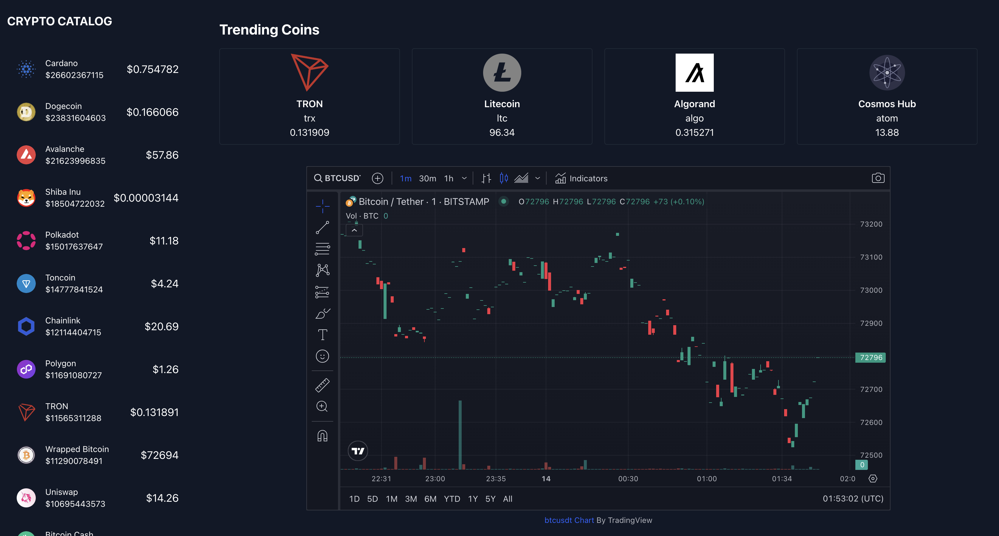

<h3 align="left">Crypto Labs</h3>

 <b>Crypto Labs</b> is a Cryptocurrency tracker with React js + TradngView gadget
      

## 🧐 About 

Crypto labs is a simple react app for track a coin with some feature like list trending coins or Trading view as a chart.

## Run:

cd /project_folder

## Run docker build Command

        docker build -t react-app .

## Run docker

        docker run -p 3000:3000 react-app

## ⛏️ Built Using 

- [React JS](https://reactjs.org/) - Front-End Library
- [CoinGecko](https://www.coingecko.com/) - API
- [axios](https://axios-http.com/) - Fetch Alternative
